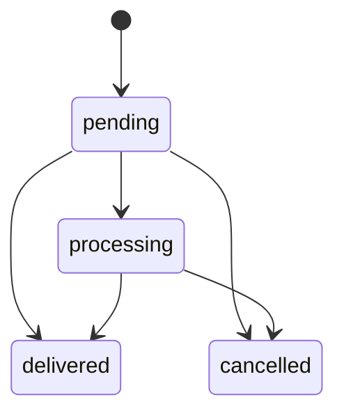
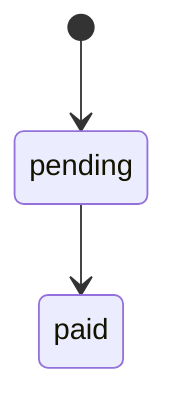

# Admin Panel

## Introduction

This document explains how the admin panel works, including authentication, navigation, order management, and real-time notifications.

## Admin Access Model

Admin access is enforced on both frontend and backend:

- Frontend guard: `AdminGuard` in `src/App.jsx`
  - redirects non-admin users to `/login`
- Backend guard: `protect` + `isAdmin` middleware
  - blocks non-admin access to admin APIs with `403`

User roles are stored in the `User` model as:

- `user`
- `admin`

## Admin Routes (Frontend)

| Route | Component | Purpose |
|---|---|---|
| `/admin` | `AdminDashboard` | Overview dashboard |
| `/admin/orders` | `AdminOrders` | Order search, detail, payment and delivery actions |
| `/admin/products` | `AdminProducts` | Product listing and management |
| `/admin/products/add` | `AdminProductForm` | Add new product |
| `/admin/products/edit/:id` | `AdminProductForm` | Edit existing product |
| `/admin/categories` | `AdminCategories` | Category CRUD |
| `/admin/offers` | `AdminOffers` | Offer CRUD |

## Admin Navigation and Layout

`AdminLayout` provides:

- Sidebar navigation
- Mobile drawer for small screens
- Logout action
- Storefront quick link
- Global socket listener for new order audio alerts

## Admin API Surface

The admin panel interacts with these protected APIs:

| Domain | Endpoints |
|---|---|
| Orders | `GET /api/orders`, `PATCH /api/orders/:id/deliver`, `PATCH /api/orders/:id/mark-paid` |
| Products | `POST/PUT/DELETE /api/products`, `PATCH /api/products/:id/stock` |
| Categories | `POST/PUT/DELETE /api/categories/:id` |
| Offers | `POST/PUT/DELETE /api/offers/:id`, `PATCH /api/offers/:id/toggle` |
| Media | `POST /api/upload`, `DELETE /api/upload/:public_id` |

## Order Management Workflow

### What admins can do

- View all orders
- Search orders by id, customer name, phone, or email
- Open order detail modal
- Mark payment as paid
- Mark order as delivered
- View UPI transaction id when submitted by customer

### Order status lifecycle

### Payment status lifecycle

## Real-Time Admin Behavior

When a new order is created:

1. Backend emits `newOrder` over Socket.IO.
2. `AdminOrders` updates list with incoming order.
3. Row highlight is shown for a short duration.
4. `AdminLayout` plays notification sound.

## Product Management Notes

- Image uploads are sent to `/api/upload` before final product save.
- Uploaded images are stored in Cloudinary and product stores resulting URL.
- Product pricing supports both `mrp` and `originalPrice` compatibility fields.

## Security and Operational Recommendations

- Use strong `JWT_SECRET` in production.
- Restrict admin account creation and role escalation at database/admin tools level.
- Serve admin over HTTPS only in production.
- Rotate SMTP, MongoDB, and Cloudinary credentials periodically.

## Common Admin Troubleshooting Tips

- If admin sees empty order list, verify token and role.
- If mark-as-delivered fails, check endpoint auth and order id validity.
- If image upload fails, verify file type/size and Cloudinary credentials.
- If notification sound does not play, verify browser autoplay permission and socket connectivity.
