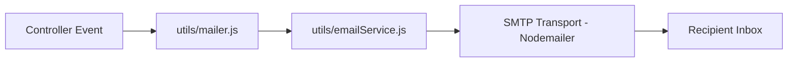

# Email System

## Introduction

This document explains how email delivery works in the project, including SMTP configuration, helper utilities, and where emails are triggered.

## Email Architecture



- `utils/mailer.js` re-exports from `utils/emailService.js`.
- All controllers call `sendEmail()` through this utility.
- SMTP transport is verified before sending.

## SMTP Configuration

The service uses Nodemailer with runtime configuration from environment variables.

### Required variables

| Variable | Required | Notes |
|---|---|---|
| `SMTP_HOST` | Yes | SMTP host (for example Brevo relay host) |
| `SMTP_USER` | Yes | SMTP username |
| `SMTP_PASS` | Yes | SMTP password |

### Optional variables

| Variable | Required | Default |
|---|---|---|
| `SMTP_PORT` | No | `2525` |
| `EMAIL_FROM` | No | `Mahalaxmi Steels <mahalaxmisteels08@gmail.com>` |

## Reliability Behavior

The email service includes resilience features:

- Connection verification before use.
- Connection timeout (`10000ms`).
- Retry with fallback port `2525` when connection/send errors suggest transport problems.
- Structured error logging for troubleshooting.

## Trigger Points

### Authentication flow (`authController.js`)

| Trigger | Recipient | Subject |
|---|---|---|
| Register | Customer | `Verify your email - Mahalaxmi Steels` |
| Email verified | Customer | `Welcome to Mahalaxmi Steels!` |
| Resend verification | Customer | `New verification link - Mahalaxmi Steels` |

### Order flow (`orderController.js`)

| Trigger | Recipient | Subject pattern |
|---|---|---|
| Order created | Customer | `Order Confirmed #<orderId>` |
| Order created | Admin (`ADMIN_EMAIL`) | `New Order #<orderId>` |
| Mark delivered | Customer | `Order Delivered #<orderId>` |
| Mark delivered | Admin (`ADMIN_EMAIL`) | `Order Delivered #<orderId>` |

### Contact flow (`contactController.js`)

| Trigger | Recipient | Subject |
|---|---|---|
| Contact form submit | Admin (`ADMIN_EMAIL`) | `New Contact: <subject>` |
| Contact form submit | Customer | `We received your message - Mahalaxmi Steels` |

## HTML Templates

Templates are currently embedded in controller files as inline HTML strings.

Common sections used in templates:

- Header block with brand colors
- Personalized greeting
- Context details (order summary, contact details, verification links)
- Footer or support note

## Startup Verification (Recommended)

You can verify SMTP readiness during startup by calling `verifyEmailService()`.

Example pattern:

```js
const { verifyEmailService } = require("./utils/emailService");

verifyEmailService()
  .then((info) => console.log("Email ready:", info))
  .catch((err) => console.error("Email setup failed:", err.message));
```

## Best Practices for Future Maintenance

- Move templates into dedicated template files for easier editing and localization.
- Add queue/retry semantics (for example BullMQ) if email volume grows.
- Add monitoring around send failures and response times.
- Keep credentials in platform secret managers, never in source control.

## Example Minimal Email Send

```js
const { sendEmail } = require("../utils/mailer");

await sendEmail(
  "customer@example.com",
  "Order update",
  "<p>Your order status changed.</p>"
);
```
