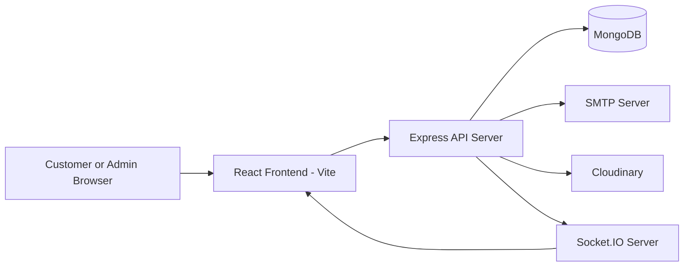
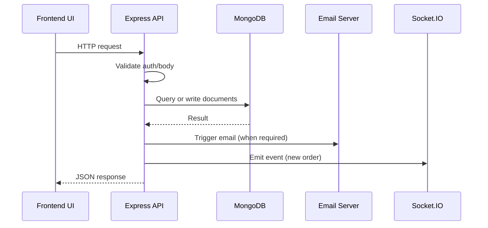

# Project Architecture

## Introduction

This document explains how the Mahalaxmi Steels platform is structured across frontend, backend, database, and real-time communication layers.

## High-Level Architecture

## Monorepo Layout

| Directory | Purpose |
|---|---|
| `backend/` | API server, business logic, data models, integrations |
| `frontend/` | React application for storefront and admin panel |
| `docs/` | Technical documentation and maintenance guides |

## Backend Architecture

### Core boot flow

1. Load environment variables (`dotenv`).
2. Connect to MongoDB (`config/db.js`).
3. Build Express app (`server.js`).
4. Register middleware (CORS, body parsing, auth, error handlers).
5. Register API routes.
6. Initialize Socket.IO (`socket.js`) on the same HTTP server.
7. Start listening on `PORT`.

### Backend modules

| Module | Responsibility |
|---|---|
| `config/db.js` | MongoDB connection with timeout handling |
| `config/cloudinary.js` | Cloudinary setup and multer memory storage |
| `controllers/` | Request handlers and business logic |
| `models/` | Mongoose schemas and data rules |
| `routes/` | API route declarations and middleware binding |
| `middleware/authMiddleware.js` | JWT auth and admin role check |
| `middleware/errorMiddleware.js` | 404 and global error responses |
| `utils/emailService.js` | SMTP transport, retries, and email sending |
| `utils/delivery.js` | Delivery radius validation via geocoding |
| `socket.js` | Socket.IO initialization and access helper |

## Frontend Architecture

### Main composition

- Routing and page composition: `src/App.jsx`
- Providers bootstrap: `src/main.jsx`
  - `AuthProvider`
  - `ProductProvider`
  - `CartProvider`
  - `ErrorBoundary`

### Frontend layers

| Layer | Key files | Responsibility |
|---|---|---|
| Routing | `src/App.jsx` | Public routes and admin route protection |
| Auth state | `src/context/AuthContext.jsx` | Login, register, profile update, token restore |
| Commerce state | `src/context/ProductContext.jsx` | Product/category/offer data and order actions |
| Cart state | `src/context/CartContext.jsx` | Cart storage per guest or per user |
| API client | `src/utils/api.js` | Base URL and HTTP helpers |
| Admin views | `src/admin/*` | Admin dashboard, CRUD forms, order operations |
| Customer views | `src/pages/*` | Catalog, product details, checkout, policies |

## Data Layer

### Primary models

| Model | Key data |
|---|---|
| `User` | identity, role (`user` or `admin`), verification state, addresses |
| `Product` | catalog details, pricing, stock, metadata |
| `Category` | canonical category id and display fields |
| `Offer` | promotional cards and active state |
| `Order` | customer snapshot, items, payment, lifecycle state |

### Relationship summary

- One `User` can have many `Order` records.
- Each `Order` embeds item snapshots and can reference product IDs.
- Products map to category values used for filtering and display.

## Request Lifecycle

## Real-Time Layer

- Socket server is initialized once in backend startup.
- Event currently used for admin updates: `newOrder`.
- Admin frontend connects to the socket and updates the UI instantly.

## Security and Access Control

- JWT bearer token required for protected routes.
- Role check middleware enforces admin-only endpoints.
- Admin routes in frontend are wrapped by `AdminGuard`.

## Runtime Configuration

Runtime is configured through environment variables. Core groups:

- Application: `PORT`, `NODE_ENV`, `CLIENT_URL`, `FRONTEND_URL`
- Database: `MONGO_URI`
- Auth: `JWT_SECRET`, `JWT_EXPIRE`, `GOOGLE_CLIENT_ID`
- Email: `SMTP_HOST`, `SMTP_PORT`, `SMTP_USER`, `SMTP_PASS`, `EMAIL_FROM`, `ADMIN_EMAIL`
- Media: `CLOUDINARY_CLOUD_NAME`, `CLOUDINARY_API_KEY`, `CLOUDINARY_API_SECRET`
- Frontend: `VITE_API_URL`, `VITE_GOOGLE_CLIENT_ID`, `VITE_SHOP_UPI_ID`

## Maintenance Notes

- Keep route definitions thin and business rules in controllers.
- Keep model fields backward-compatible because frontend reads both modern and legacy keys for some entities.
- Validate production CORS and frontend URL settings before deployment.
- Monitor SMTP and geocoding dependencies because they are external services.
