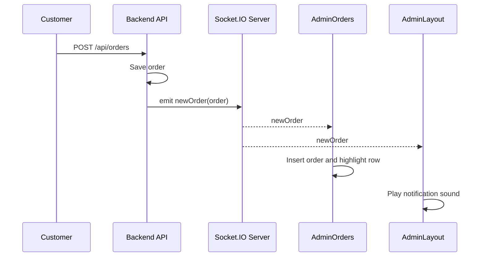

# Realtime Notifications

## Introduction

This document explains the real-time order notification flow built with Socket.IO for admin users.

## Purpose

Real-time notifications allow admins to see new orders immediately without manually refreshing the page.

## Backend Socket Setup

- Socket server is initialized in `backend/socket.js`.
- Initialization happens from `server.js` through `initSocket(server)`.
- CORS is configured using `CLIENT_URL`.
- Supported transports: `websocket`, `polling`.

### Backend event emission

In `orderController.js`, after successful order creation:

- `getIO()` retrieves initialized socket server.
- `io.emit("newOrder", order)` broadcasts the new order payload.

## Frontend Socket Usage

### Socket URL resolution

Admin components derive socket URL from `VITE_API_URL` by removing `/api` suffix if present.

### Admin listeners

| Component | Behavior on `newOrder` |
|---|---|
| `AdminOrders.jsx` | Adds incoming order to top of list and highlights it |
| `AdminLayout.jsx` | Plays new order sound, loops while tab hidden |

## Event Contract

| Event | Direction | Payload |
|---|---|---|
| `newOrder` | Server -> clients | Full created order object |

Example payload (simplified):

```json
{
  "_id": "65f2...",
  "orderId": "MHL123456",
  "customer": {
    "name": "Rahul Patil",
    "email": "rahul@example.com",
    "phone": "9876543210"
  },
  "items": [
    { "name": "Steel Kadai", "quantity": 1, "price": 799 }
  ],
  "total": 928,
  "status": "pending",
  "createdAt": "2026-03-14T09:00:00.000Z"
}
```

## Sequence Diagram



## Operational Considerations

- The system currently broadcasts to all connected admin clients.
- There is no room-based segmentation yet.
- If socket initialization fails, order creation still succeeds.
- Admin UI handles reconnect behavior via Socket.IO defaults and explicit options.

## Recommended Future Enhancements

- Emit role-scoped events using namespaces or rooms.
- Add auth handshake for socket connections.
- Add events for status transitions (`orderPaid`, `orderDelivered`).
- Add acknowledgement tracking for critical real-time messages.
